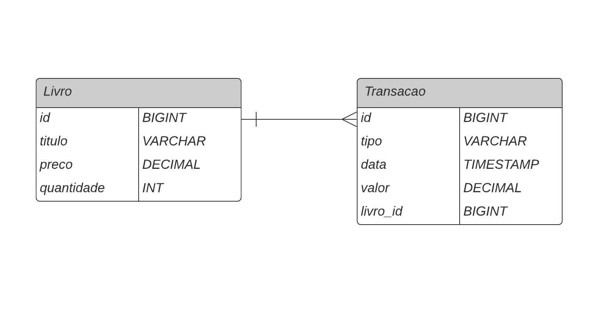

# Sebo Literário (Backend)

# Sobre o projeto

Este projeto foi desenvolvido como parte de um trabalho de extensão universitária que visa impactar a comunidade e comércio local através dos conhecimentos adquiridos em curso. 
O alvo deste projeto foi um sebo literário que utilizava-se de métodos manuais para seu gerenciamento, o que limitava sua eficiência operacional. 
O sistema desenvolvido simplifica significativamente esse processo ao automatizar tarefas e fornecer acesso simplificado às informações essenciais.

# Diagrama Entidade Relacionamento



# Diagrama de Atividades


# Tecnologias utilizadas
- Java 17
- Spring Boot 3.2.5
- JPA / Hibernate
- Maven
- PostgreSQL

## API Endpoints

- Adicionar Livro
```
POST /api/v1/livros

{
	"titulo": "Sherlock Holmes",
	"quantidade": 1,
	"preco": 5.59
}
```

<hr>

- Vender Livro
```
PUT /api/v1/livros/:id
```

<hr>

- Trocar Livros
```
POST /api/v1/livros/trade

{
	"livroRecebido": {
		"titulo": "Novo Livro",
		"preco": 10.20,
		"quantidade": 1
	},
	"livroTrocadoId": 1
}
```

<hr>

- Buscar todos os livros
```
GET /api/v1/livros
```

<hr>

- Buscar informações de um livro específico
```
GET /api/v1/livros/:id
```

<hr>

- Busca por livros baseado no titulo
```
GET api/v1/livros/search?titulo=abc
```

<hr>

# Autor

Lucas Campos

https://www.linkedin.com/in/lucascamposdev/


